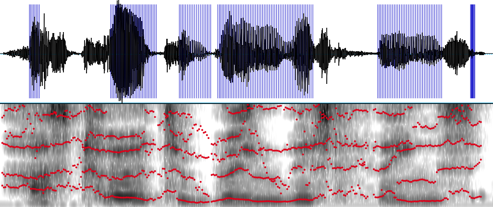

# Accent Inspector

Accent Inspector is your solution to automated accent detection. Accent Inspector can determine whether an individual is a native English speaker based on their speech. All  you need is a recording of the person in question reading the following phrase:

"Please call Stella, ask her to bring these things with her from the store."

Accent Inspector classifies the person as either a native or a non-native English speaker using formant analysis and a Support Vector Machine. Applications for this include identifying customer types and providing targeted customer service and marketing.

## Using the Model

This repo contains the code for recreating the inspector. The data folder contains .txt files precompiled for training the model. To use the data files and run the model, follow the Quickstart Setup instructions. To scrape and format the data yourself, follow the Full Setup instructions (this will require downloading a third-party software). All scripts are located in the code folder.

### Files Included

code  
*    scrape_data.py  
*    get_formants_pulses.praat  
*    mongo_setup.py  
*    basic_models.py  
*    pulse_analysis.py  
*    undersample.py  
*    uniformity.py  
*    cross_validate.py

data  
*    afroasiatic - formant and pulse files for accents in the Afroasiatic language family  
*    european - formant and pulse files for the European language family  
*    indo_iranian - formant and pulse files for the Indo-Iranian language family  
*    sino_tibetan - formant and pulse files for the Sino-Tibetan language family  

### Quickstart Setup

This setup utilizes the data files available in the data folder. If you prefer to run through the entire experiment, including scraping and extracting the data, please refer to the Full Setup. This will require you to install Praat, a free software.

**Step 1:** Run mongo_setup.py

This will prepare the mongoDB database using the formant and pulse files in the data folder. The mongo_setup script is in the code folder.

**Step 2:** Run basic_models.py

This will build and test the model. 

### Full Setup

**Step 1:** Run scrape_data.py

This will scrape the mp3 files for analysis. We will save native language, birth country, and gender as well for use in further analysis. The data source is [The Speech Accent Archive](http://accent.gmu.edu/), a free accent database.

**Step 2:** Download Praat

Praat is a free linguistic software and is necessary for Accent Inspector to extract the data required to make predictions. We will be using the formant and pulse data that Praat derives from our audio files. Go to [Praat's webpage](http://www.fon.hum.uva.nl/praat/) to download.

**Step 3:** Run get_formants_pulses.praat

The file will need to be in the same folder as the audio files you have downloaded. It may be best to place a copy of the file in each directory where files are stored. You will also need to edit the input and output directories in the file, so that they match the desired input and output locations on your computer. Be sure that Praat is set as the default application for files of this type and open the file. You may need to click 'Run' in Praat, and Praat will begin scraping the formant and pulse data for the first 20 seconds of each audio file in .txt files.

**Step 4:** Run mongo_setup.py

This will prepare the mongoDB database using the formant and pulse files in the data folder. The mongo_setup script is in the code folder.

**Step 5:** Run basic_models.py

This will build and test the model.